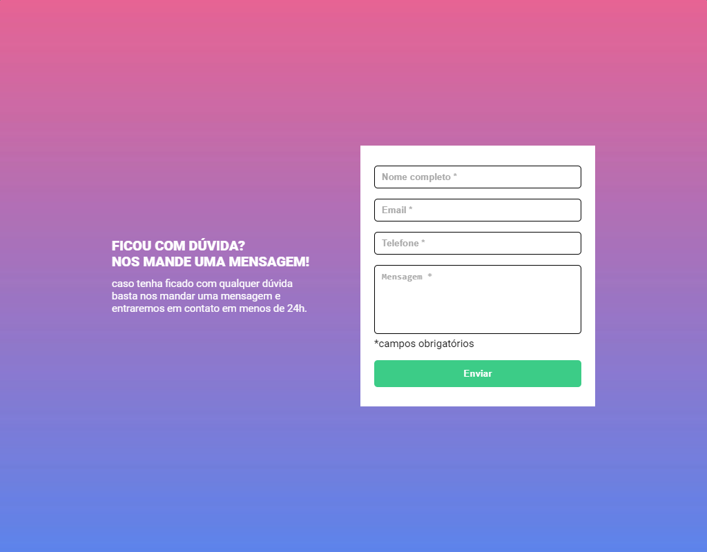
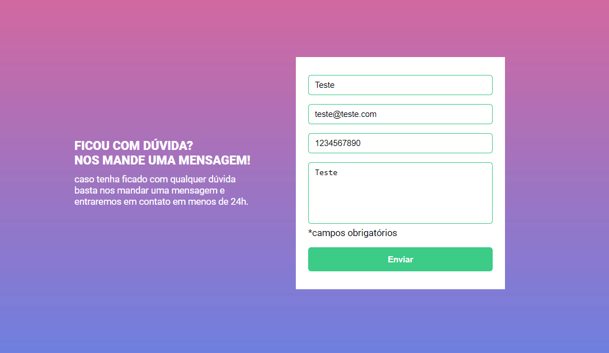
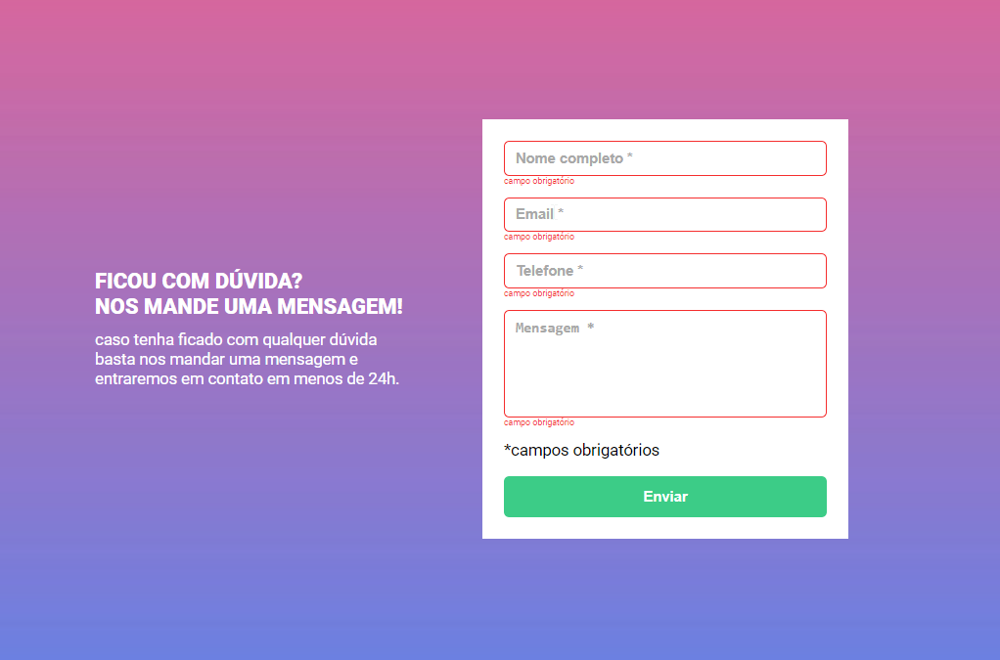

# Dev Quest - Formulário com validação

Esta é a minha solução para a Quest de HTML, CSS e JavaScript Intermediário do curso DEV QUEST do [Dev Em Dobro](https://www.instagram.com/devemdobro/).

## Sumário

- [**Visão Geral**](#visão-geral)
  - [**O desafio**](#o-desafio)
  - [**Capturas de Tela**](#capturas-de-tela)
  - [**Links**](#links)
- [**Meu Processo**](#meu-processo)
  - [**Construído com**](#construído-com)
  - [**O que aprendi**](#o-que-aprendi)
- [**Autor**](#autor)

# Visão Geral

### O desafio

O desafio se consiste na criação de um formulário.

Pontos de atenção:

- A validação do formulário deve ser feita com
javascript puro;
- Ao clicar para enviar o formulário, se caso
algum campo não estiver preenchido, a borda
do input deve ficar vermelha e uma mensagem
de "campo obrigatório" deve aparecer embaixo
do campo que não foi preenchido;
- Ao preencher um input, a borda do mesmo deve ficar verde para representar a presença de conteúdo.

## Capturas de Tela

Aqui estão capturas de tela do projeto no estado inicial e no estado com as devidas validações.

### **Visualização padrão**

### **Visualização formulário válido**

### **Visualização para Desktop**

### Links
- URL do Site Ativo: [Veja o site em execução aqui!](https://guisalva.github.io/Quest-Html-Css-Js-Intermediario/)

# Meu Processo

### Construído com

- Marcação HTML5 semântica
- Propriedades personalizadas de CSS
- Manipulação de elementos web com JavaScript
- [Google Fonts](https://fonts.google.com/)

### O que aprendi

Com este projeto, consegui praticar e consolidar meu conhecimento em JavaScript, pude tirar dúvidas pertinentes a respeito da manipulação de eventos e elementos HTML via JS.

# Autor

- GitHub - [GuiSalva](https://github.com/guisalva)
- LinkedIn - [Guilherme Salvador](https://www.linkedin.com/in/guisalva)
